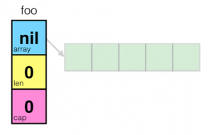

# GO编程模式：切片，接口，时间和性能

[2020年12月18日 ](https://coolshell.cn/articles/21128.html) [陈皓](https://coolshell.cn/articles/author/haoel)


在本篇文章中，我会对Go语言编程模式的一些基本技术和要点，这样可以让你更容易掌握Go语言编程。其中，主要包括，数组切片的一些小坑，还有接口编程，以及时间和程序运行性能相关的话题。

### 本文是全系列中第1 / 10篇：[Go编程模式](https://coolshell.cn/articles/series/go编程模式)

- Go编程模式：切片，接口，时间和性能
- [Go 编程模式：错误处理](https://coolshell.cn/articles/21140.html)
- [Go 编程模式：Functional Options](https://coolshell.cn/articles/21146.html)
- [Go编程模式：委托和反转控制](https://coolshell.cn/articles/21214.html)
- [Go编程模式：Map-Reduce](https://coolshell.cn/articles/21164.html)
- [Go 编程模式：Go Generation](https://coolshell.cn/articles/21179.html)
- [Go编程模式：修饰器](https://coolshell.cn/articles/17929.html)
- [Go编程模式：Pipeline](https://coolshell.cn/articles/21228.html)
- [Go 编程模式：k8s Visitor 模式](https://coolshell.cn/articles/21263.html)
- [Go编程模式 ： 泛型编程](https://coolshell.cn/articles/21615.html)

[下一篇文章](https://coolshell.cn/articles/21140.html) »

目录


[Slice](https://coolshell.cn/articles/21128.html#Slice)[深度比较](https://coolshell.cn/articles/21128.html#深度比较)[接口编程](https://coolshell.cn/articles/21128.html#接口编程)[接口完整性检查](https://coolshell.cn/articles/21128.html#接口完整性检查)[时间](https://coolshell.cn/articles/21128.html#时间)[性能提示](https://coolshell.cn/articles/21128.html#性能提示)[参考文档](https://coolshell.cn/articles/21128.html#参考文档)

#### Slice

首先，我们先来讨论一下Slice，中文翻译叫“切片”，这个东西在Go语言中不是数组，而是一个结构体，其定义如下：

```go
**type** slice **struct** {
    array unsafe.Pointer //指向存放数据的数组指针
    len   **int**            //长度有多大
    cap   **int**            //容量有多大
}
```

用图示来看，一个空的slice的表现如下：

熟悉C/C++的同学一定会知道，在结构体里用数组指针的问题——数据会发生共享！下面我们来看一下slice的一些操作


```go
foo = make([]**int**, 5)
foo[3] = 42
foo[4] = 100

bar  := foo[1:4]
bar[1] = 99
```

对于上面这段代码。

- 首先先创建一个foo的slice，其中的长度和容量都是5
- 然后开始对foo所指向的数组中的索引为3和4的元素进行赋值
- 然后，对foo做切片后赋值给bar，再修改bar[1]


通过上图我们可以看到，因为foo和bar的内存是共享的，所以，foo和bar的对数组内容的修改都会影响到对方。

接下来，我们再来看一个数据操作 `append()` 的示例

```go
a := make([]int, 32)
b := a[1:16]
a = append(a, 1)
a[2] = 42
```

上面这段代码中，把 `a[1:16]` 的切片赋给到了 `b` ，此时，`a` 和 `b` 的内存空间是共享的，然后，对 `a`做了一个 `append()`的操作，这个操作会让 `a` 重新分享内存，导致 `a` 和 `b` 不再共享，如下图所示：


从上图我们可以看以看到 `append()`操作让 `a` 的容量变成了64，而长度是33。这里，需要重点注意一下——**`append()`这个函数在 `cap` 不够用的时候就会重新分配内存以扩大容量，而如果够用的时候不不会重新分享内存！**

我们再看来看一个例子：

```go
func main() {
    path := []byte("AAAA/BBBBBBBBB")
    sepIndex := bytes.IndexByte(path,'/’)

    dir1 := path[:sepIndex]
    dir2 := path[sepIndex+1:]

    fmt.Println("dir1 =>",string(dir1)) //prints: dir1 => AAAA
    fmt.Println("dir2 =>",string(dir2)) //prints: dir2 => BBBBBBBBB

    dir1 = append(dir1,"suffix"...)

    fmt.Println("dir1 =>",string(dir1)) //prints: dir1 => AAAAsuffix
    fmt.Println("dir2 =>",string(dir2)) //prints: dir2 => uffixBBBB
}
```

上面这个例子中，`dir1` 和 `dir2` 共享内存，虽然 `dir1` 有一个 `append()` 操作，但是因为 cap 足够，于是数据扩展到了`dir2` 的空间。下面是相关的图示（注意上图中 `dir1` 和 `dir2` 结构体中的 `cap` 和 `len` 的变化）


如果要解决这个问题，我们只需要修改一行代码。

```go
dir1 := path[:sepIndex]
```

修改为

```go
dir1 := path[:sepIndex:sepIndex]
```

新的代码使用了 Full Slice Expression，其最后一个参数叫“Limited Capacity”，于是，后续的 `append()` 操作将会导致重新分配内存。

#### 深度比较

当我们复杂一个对象时，这个对象可以是内建数据类型，数组，结构体，map……我们在复制结构体的时候，当我们需要比较两个结构体中的数据是否相同时，我们需要使用深度比较，而不是只是简单地做浅度比较。这里需要使用到反射 `reflect.DeepEqual()` ，下面是几个示例

```go
import (
    "fmt"
    "reflect"
)

func main() {

    v1 := data{}
    v2 := data{}
    fmt.Println("v1 == v2:",reflect.DeepEqual(v1,v2))
    //prints: v1 == v2: true

    m1 := map[string]string{"one": "a","two": "b"}
    m2 := map[string]string{"two": "b", "one": "a"}
    fmt.Println("m1 == m2:",reflect.DeepEqual(m1, m2))
    //prints: m1 == m2: true

    s1 := []int{1, 2, 3}
    s2 := []int{1, 2, 3}
    fmt.Println("s1 == s2:",reflect.DeepEqual(s1, s2))
    //prints: s1 == s2: true
}
```

#### 接口编程

下面，我们来看段代码，其中是两个方法，它们都是要输出一个结构体，其中一个使用一个函数，另一个使用一个“成员函数”。

```go
func PrintPerson(p *Person) {
    fmt.Printf("Name=%s, Sexual=%s, Age=%d\n",
  p.Name, p.Sexual, p.Age)
}

func (p *Person) Print() {
    fmt.Printf("Name=%s, Sexual=%s, Age=%d\n",
  p.Name, p.Sexual, p.Age)
}

func main() {
    var p = Person{
        Name: "Hao Chen",
        Sexual: "Male",
        Age: 44,
    }

    PrintPerson(&p)
    p.Print()
}
```

你更喜欢哪种方式呢？在 Go 语言中，使用“成员函数”的方式叫“Receiver”，这种方式是一种封装，因为 `PrintPerson()`本来就是和 `Person`强耦合的，所以，理应放在一起。更重要的是，这种方式可以进行接口编程，对于接口编程来说，也就是一种抽象，主要是用在“多态”，这个技术，在《[Go语言简介（上）：接口与多态](https://coolshell.cn/articles/8460.html#接口和多态)》中已经讲过。在这里，我想讲另一个Go语言接口的编程模式。

首先，我们来看一下，有下面这段代码：

```go
type Country struct {
    Name string
}

type City struct {
    Name string
}

type Printable interface {
    PrintStr()
}
func (c Country) PrintStr() {
    fmt.Println(c.Name)
}
func (c City) PrintStr() {
    fmt.Println(c.Name)
}

c1 := Country {"China"}
c2 := City {"Beijing"}
c1.PrintStr()
c2.PrintStr()
```

其中，我们可以看到，其使用了一个 `Printable` 的接口，而 `Country` 和 `City` 都实现了接口方法 `PrintStr()` 而把自己输出。然而，这些代码都是一样的。能不能省掉呢？

我们可以使用“结构体嵌入”的方式来完成这个事，如下的代码所示，

```go
type WithName struct {
    Name string
}

type Country struct {
    WithName
}

type City struct {
    WithName
}

type Printable interface {
    PrintStr()
}

func (w WithName) PrintStr() {
    fmt.Println(w.Name)
}

c1 := Country {WithName{ "China"}}
c2 := City { WithName{"Beijing"}}
c1.PrintStr()
c2.PrintStr()
```

引入一个叫 `WithName`的结构体，然而，所带来的问题就是，在初始化的时候，变得有点乱。那么，我们有没有更好的方法？下面是另外一个解。

```go
type Country struct {
    Name string
}

type City struct {
    Name string
}

type Stringable interface {
    ToString() string
}
func (c Country) ToString() string {
    return "Country = " + c.Name
}
func (c City) ToString() string{
    return "City = " + c.Name
}

func PrintStr(p Stringable) {
    fmt.Println(p.ToString())
}

d1 := Country {"USA"}
d2 := City{"Los Angeles"}
PrintStr(d1)
PrintStr(d2)
```

上面这段代码，我们可以看到——**我们使用了一个叫`Stringable` 的接口，我们用这个接口把“业务类型” `Country` 和 `City` 和“控制逻辑” `Print()` 给解耦了。**于是，只要实现了`Stringable` 接口，都可以传给 `PrintStr()` 来使用。

这种编程模式在Go 的标准库有很多的示例，最著名的就是 `io.Read` 和 `ioutil.ReadAll` 的玩法，其中 `io.Read` 是一个接口，你需要实现他的一个 `Read(p []byte) (n int, err error)` 接口方法，只要满足这个规模，就可以被 `ioutil.ReadAll`这个方法所使用。**这就是面向对象编程方法的黄金法则——“Program to an interface not an implementation”**

#### 接口完整性检查

另外，我们可以看到，Go语言的编程器并没有严格检查一个对象是否实现了某接口所有的接口方法，如下面这个示例：

```go
type Shape interface {
    Sides() int
    Area() int
}
type Square struct {
    len int
}
func (s* Square) Sides() int {
    return 4
}
func main() {
    s := Square{len: 5}
    fmt.Printf("%d\n",s.Sides())
}
```

我们可以看到 `Square` 并没有实现 `Shape` 接口的所有方法，程序虽然可以跑通，但是这样编程的方式并不严谨，如果我们需要强制实现接口的所有方法，那么我们应该怎么办呢？

在Go语言编程圈里有一个比较标准的作法：

```go
**var** _ Shape = (*Square)(**nil**)
```

声明一个 `_` 变量（没人用），其会把一个 `nil` 的空指针，从 `Square` 转成 `Shape`，这样，如果没有实现完相关的接口方法，编译器就会报错：

> cannot use (*Square)(nil) (type *Square) as type Shape in assignment: *Square does not implement Shape (missing Area method)

这样就做到了个强验证的方法。

#### 时间

对于时间来说，这应该是编程中比较复杂的问题了，相信我，时间是一种非常复杂的事（比如《[你确信你了解时间吗？](https://coolshell.cn/articles/5075.html)》、《[关于闰秒](https://coolshell.cn/articles/7804.html)》等文章）。而且，时间有时区、格式、精度等等问题，其复杂度不是一般人能处理的。所以，一定要重用已有的时间处理，而不是自己干。

在 Go 语言中，你一定要使用 `time.Time` 和 `time.Duration` 两个类型：

- 在命令行上，`flag` 通过 `time.ParseDuration` 支持了 `time.Duration`
- JSon 中的 `encoding/json` 中也可以把`time.Time` 编码成 [RFC 3339](https://tools.ietf.org/html/rfc3339) 的格式
- 数据库使用的 `database/sql` 也支持把 `DATATIME` 或 `TIMESTAMP` 类型转成 `time.Time`
- YAML你可以使用 `gopkg.in/yaml.v2` 也支持 `time.Time` 、`time.Duration` 和 [RFC 3339](https://tools.ietf.org/html/rfc3339) 格式

如果你要和第三方交互，实在没有办法，也请使用 [RFC 3339](https://tools.ietf.org/html/rfc3339) 的格式。

最后，如果你要做全球化跨时区的应用，你一定要把所有服务器和时间全部使用UTC时间。

#### 性能提示

Go 语言是一个高性能的语言，但并不是说这样我们就不用关心性能了，我们还是需要关心的。下面是一个在编程方面和性能相关的提示。

- 如果需要把数字转字符串，使用 `strconv.Itoa()` 会比 `fmt.Sprintf()` 要快一倍左右
- 尽可能地避免把`String`转成`[]Byte` 。这个转换会导致性能下降。
- 如果在for-loop里对某个slice 使用 `append()`请先把 slice的容量很扩充到位，这样可以避免内存重新分享以及系统自动按2的N次方幂进行扩展但又用不到，从而浪费内存。
- 使用`StringBuffer` 或是`StringBuild` 来拼接字符串，会比使用 `+` 或 `+=` 性能高三到四个数量级。
- 尽可能的使用并发的 go routine，然后使用 `sync.WaitGroup` 来同步分片操作
- 避免在热代码中进行内存分配，这样会导致gc很忙。尽可能的使用 `sync.Pool` 来重用对象。
- 使用 lock-free的操作，避免使用 mutex，尽可能使用 `sync/Atomic`包。 （关于无锁编程的相关话题，可参看《[无锁队列实现](https://coolshell.cn/articles/8239.html)》或《[无锁Hashmap实现](https://coolshell.cn/articles/9703.html)》）
- 使用 I/O缓冲，I/O是个非常非常慢的操作，使用 `bufio.NewWrite()` 和 `bufio.NewReader()` 可以带来更高的性能。
- 对于在for-loop里的固定的正则表达式，一定要使用 `regexp.Compile()` 编译正则表达式。性能会得升两个数量级。
- 如果你需要更高性能的协议，你要考虑使用 [protobuf](https://github.com/golang/protobuf) 或 [msgp](https://github.com/tinylib/msgp) 而不是JSON，因为JSON的序列化和反序列化里使用了反射。
- 你在使用map的时候，使用整型的key会比字符串的要快，因为整型比较比字符串比较要快。

#### 参考文档

还有很多不错的技巧，下面的这些参考文档可以让你写出更好的Go的代码，必读！

- **Effective Go**
  https://golang.org/doc/effective_go.html
- **Uber Go Style**
  https://github.com/uber-go/guide/blob/master/style.md
- **50 Shades of Go: Traps, Gotchas, and Common Mistakes for New Golang Devs**
  http://devs.cloudimmunity.com/gotchas-and-common-mistakes-in-go-golang/
- **Go** **Advice**
  https://github.com/cristaloleg/go-advice
- **Practical Go Benchmarks**
  https://www.instana.com/blog/practical-golang-benchmarks/
- **Benchmarks of Go serialization methods**
  https://github.com/alecthomas/go_serialization_benchmarks
- **Debugging** **performance** **issues** **in** **Go** **programs**
  https://github.com/golang/go/wiki/Performance
- **Go** **code** **refactoring:** **the** **23x** **performance** **hunt**
  https://medium.com/@val_deleplace/go-code-refactoring-the-23x-performance-hunt-156746b522f7

（全文完）