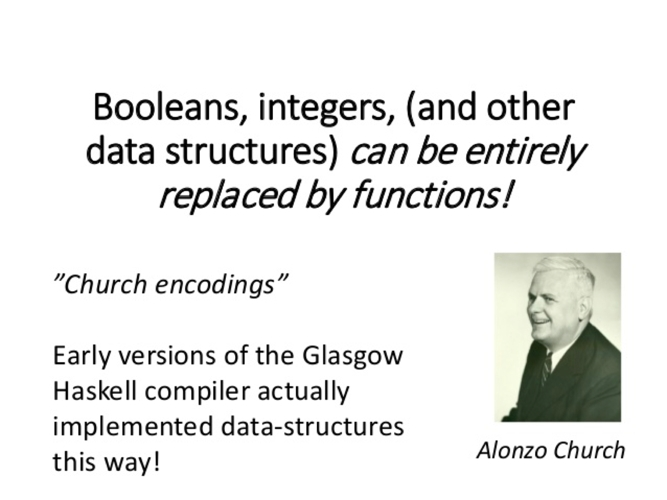

# 33-编程范式游记（4）-函数式编程

从前三章内容中，我们了解到，虽然C语言简单灵活，能够让程序员在高级语言特性之上轻松进行底层上的微观控制，被誉为“高级语言中的汇编语言”，但其基于过程和底层的设计初衷又成了它的短板。

在程序世界中，编程工作更多的是解决业务上的问题，而不是计算机的问题，我们需要更为贴近业务、更为抽象的语言，如典型的面向对象语言C++和Java等。

C++很大程度上解决了C语言中的各种问题和不便，尤其是通过类、模板、虚函数和运行时识别等解决了C语言的泛型编程问题。然而，如何做更为抽象的泛型呢？答案就是函数式编程（Functional Programming）。

## 函数式编程

相对于计算机的历史而言，函数式编程其实是一个非常古老的概念。函数式编程的基础模型来源于 λ 演算，而 λ 演算并没有被设计在计算机上执行。它是由 Alonzo Church 和 Stephen Cole Kleene 在 20 世纪 30 年代引入的一套用于研究函数定义、函数应用和递归的形式系统。

如 Alonzo 所说，像 booleans、integers 或者其他的数据结构都可以被函数取代掉。



我们来看一下函数式编程，它的理念就来自于数学中的代数。

```
f(x)=5x^2+4x+3
g(x)=2f(x)+5=10x^2+8x+11
h(x)=f(x)+g(x)=15x^2+12x+14
```

假设f(x)是一个函数，g(x)是第二个函数，把f(x)这个函数套下来，并展开。然后还可以定义一个由两个一元函数组合成的二元函数，还可以做递归，下面这个函数定义就是斐波那契数列。

```
f(x)=f(x-1)+f(x-2)
```

对于函数式编程来说，它只关心**定义输入数据和输出数据相关的关系，数学表达式里面其实是在做一种映射（mapping），输入的数据和输出的数据关系是什么样的，是用函数来定义的**。

函数式编程有以下特点。

**特征**

- **stateless**：函数不维护任何状态。函数式编程的核心精神是stateless，简而言之就是它不能存在状态，打个比方，你给我数据我处理完扔出来。里面的数据是不变的。
- **immutable**：输入数据是不能动的，动了输入数据就有危险，所以要返回新的数据集。

**优势**

- 没有状态就没有伤害。
- 并行执行无伤害。
- Copy-Paste重构代码无伤害。
- 函数的执行没有顺序上的问题。


函数式编程还带来了以下一些好处。

- **惰性求值**。这需要编译器的支持，表达式不在它被绑定到变量之后就立即求值，而是在该值被取用的时候求值。也就是说，语句如 `x:=expression;` (把一个表达式的结果赋值给一个变量)显式地调用这个表达式被计算并把结果放置到 `x` 中，但是先不管实际在 `x` 中的是什么，直到通过后面的表达式中到 `x` 的引用而有了对它的值的需求的时候，而后面表达式自身的求值也可以被延迟，最终为了生成让外界看到的某个符号而计算这个快速增长的依赖树。
- **确定性**。所谓确定性，就是像在数学中那样，`f(x) = y` 这个函数无论在什么场景下，都会得到同样的结果，而不是像程序中的很多函数那样。同一个参数，在不同的场景下会计算出不同的结果，这个我们称之为函数的确定性。所谓不同的场景，就是我们的函数会根据运行中的状态信息的不同而发生变化。

我们知道，因为状态，在并行执行和copy-paste时引发bug的概率是非常高的，所以没有状态就没有伤害，就像没有依赖就没有伤害一样，并行执行无伤害，copy代码无伤害，因为没有状态，代码怎样拷都行。

**劣势**

- 数据复制比较严重。

> **注**：有一些人可能会觉得这会对性能造成影响。其实，这个劣势不见得会导致性能不好。因为没有状态，所以代码在并行上根本不需要锁（不需要对状态修改的锁），所以可以拼命地并发，反而可以让性能很不错。比如：Erlang就是其中的代表。

对于纯函数式（也就是完全没有状态的函数）的编程来说，各个语言支持的程度如下：

- 完全纯函数式 Haskell
- 容易写纯函数 F#, Ocaml, Clojure, Scala
- 纯函数需要花点精力 C#, Java, JavaScript

完全纯函数的语言，很容易写成函数，纯函数需要花精力。只要所谓的纯函数的问题，传进来的数据不改，改完的东西复制一份拷出去，然后没有状态显示。

但是很多人并不习惯函数式编程，因为函数式编程和过程式编程的思维方式完全不一样。过程式编程是在把具体的流程描述出来，所以可以不假思索，而函数式编程的抽象度更大，在实现方式上，有函数套函数、函数返回函数、函数里定义函数……把人搞得很糊涂。

## 函数式编程用到的技术

下面是函数式编程用到的一些技术。

- **first class function（头等函数）** ：这个技术可以让你的函数就像变量一样来使用。也就是说，你的函数可以像变量一样被创建、修改，并当成变量一样传递、返回，或是在函数中嵌套函数。
- **tail recursion optimization（尾递归优化）** ： 我们知道递归的害处，那就是如果递归很深的话，stack受不了，并会导致性能大幅度下降。因此，我们使用尾递归优化技术——每次递归时都会重用stack，这样能够提升性能。当然，这需要语言或编译器的支持。Python就不支持。
- **map & reduce** ：这个技术不用多说了，函数式编程最常见的技术就是对一个集合做Map和Reduce操作。这比起过程式的语言来说，在代码上要更容易阅读。（传统过程式的语言需要使用for/while循环，然后在各种变量中把数据倒过来倒过去的）这个很像C++ STL中foreach、find_if、count_if等函数的玩法。
- **pipeline（管道）**：这个技术的意思是，将函数实例成一个一个的action，然后将一组action放到一个数组或是列表中，再把数据传给这个action list，数据就像一个pipeline一样顺序地被各个函数所操作，最终得到我们想要的结果。
- **recursing（递归）** ：递归最大的好处就简化代码，它可以把一个复杂的问题用很简单的代码描述出来。注意：递归的精髓是描述问题，而这正是函数式编程的精髓。
- **currying（柯里化）** ：将一个函数的多个参数分解成多个函数， 然后将函数多层封装起来，每层函数都返回一个函数去接收下一个参数，这可以简化函数的多个参数。在C++中，这很像STL中的bind1st或是bind2nd。
- **higher order function（高阶函数）**：所谓高阶函数就是函数当参数，把传入的函数做一个封装，然后返回这个封装函数。现象上就是函数传进传出，就像面向对象对象满天飞一样。这个技术用来做 Decorator 很不错。

上面这些技术太抽象了，我们还是从一个最简单的例子开始。

```
// 非函数式，不是pure funciton，有状态
int cnt;
void increment(){
    cnt++;
}
```

这里有个全局变量，调这个全局函数变量++，这里面是有状态的，这个状态在外部。所以，如果是多线程的话，这里面的代码是不安全的。

如果写成纯函数，应该是下面这个样子。

```
// 函数式，pure function， 无状态
int increment(int cnt){
    return cnt+1;
}
```

这个是你传给我什么，我就返回这个值的+1值，你会发现，代码随便拷，而且与线程无关，代码在并行时候不用锁，因为是复制了原有的数据，并返回了新的数据。

我们再来看另一个例子：

```
def inc(x):
    def incx(y):
        return x+y
    return incx
 
inc2 = inc(2)
inc5 = inc(5)
 
print inc2(5) # 输出 7
print inc5(5) # 输出 10
```

上面这段Python的代码，开始有点复杂了。我们可以看到上面那个例子`inc()`函数返回了另一个函数`incx()`，于是可以用`inc()`函数来构造各种版本的inc函数，比如：`inc2()`和`inc5()`。这个技术其实就是上面所说的 currying 技术.从这个技术上，你可能体会到函数式编程的理念。

- **把函数当成变量来用，关注描述问题而不是怎么实现，这样可以让代码更易读**。
- **因为函数返回里面的这个函数，所以函数关注的是表达式，关注的是描述这个问题，而不是怎么实现这个事情**。

## Lisp 语言介绍

要说函数式语言，不可避免地要说一下Lisp。

下面，我们再来看看Scheme语言（Lisp的一个方言）的函数式玩法。在Scheme里，所有的操作都是函数，包括加减乘除这样的东西。所以，一个表达式是这样的形式—— *（函数名 参数1 参数1）*

```
(define (plus x y)  (+ x y))
(define (times x y) (* x y))
(define (square x)  (times x x))
```

上面三个函数：

- 用内置的 `+` 函数定义了一个新的 `plus` 函数。
- 用内置的 `*` 函数定义了一个新的 `times` 函数。
- 用之前的 `times` 函数定义了一个 `square` 函数。

下面这个函数定义了： f(x) = 5 * x^2 +10

```
(define (f1 x) ;;; f(x) = 5 * x^2 + 10
    (plus 10 (times 5 (square x))))
```

也可以这样定义——使用 lambda 匿名函数。

```
(define f2
    (lambda (x)
        (define plus
            (lambda (a b) (+ a b)))
        (define times
            (lambda (a b) (* a b)))
        (plus 10 (times 5 (times x x)))))
```

在上面的这个代码里，我们使用 lambda 来定义函数 `f2` ，然后也同样用 lambda 定义了两个函数—— `plus` 和 `times`。 最后，由 `(plus 10 (times 5 (times x x)))` 定义了 `f2` 。

我们再来看一个阶乘的示例：

```
;;; recursion
(define factoral (lambda (x)
    (if (<= x 1) 1
        (* x (factoral (- x 1))))))

(newline)
(display(factoral 6))
```

下面是另一个版本的，使用了尾递归。

```
;;; another version of recursion
(define (factoral_x n)
    (define (iter product counter)
        (if (< counter n)
            product
            (iter (* counter product) (+ counter 1))))
    (iter 1 1))

(newline)
(display(factoral_x 5))
```

## 函数式编程的思维方式

前面提到过多次，函数式编程关注的是：describe what to do, rather than how to do it。于是，我们把以前的过程式编程范式叫做 Imperative Programming – 指令式编程，而把函数式编程范式叫做 Declarative Programming – 声明式编程。

### 传统方式的写法

下面我们看一下相关的示例。比如，我们有3辆车比赛，简单起见，我们分别给这3辆车70%的概率让它们可以往前走一步，一共有5次机会，然后打出每一次这3辆车的前行状态。

对于Imperative Programming来说，代码如下（Python）：

```
from random import random
 
time = 5
car_positions = [1, 1, 1]
 
while time:
    # decrease time
    time -= 1
 
    print ''
    for i in range(len(car_positions)):
        # move car
        if random() > 0.3:
            car_positions[i] += 1
 
        # draw car
        print '-' * car_positions[i]
```

我们可以把这两重循环变成一些函数模块，这样有利于更容易地阅读代码：

```
from random import random
 
def move_cars():
    for i, _ in enumerate(car_positions):
        if random() > 0.3:
            car_positions[i] += 1
 
def draw_car(car_position):
    print '-' * car_position
 
def run_step_of_race():
    global time
    time -= 1
    move_cars()
 
def draw():
    print ''
    for car_position in car_positions:
        draw_car(car_position)
 
time = 5
car_positions = [1, 1, 1]
 
while time:
    run_step_of_race()
    draw()
```

上面的代码，从主循环开始，我们可以很清楚地看到程序的主干，因为我们把程序的逻辑分成了几个函数。这样一来，代码逻辑就会变成几个小碎片，于是我们读代码时要考虑的上下文就少了很多，阅读代码也会更容易。不像第一个示例，如果没有注释和说明，你还是需要花些时间理解一下。而将代码逻辑封装成了函数后，我们就相当于给每个相对独立的程序逻辑取了个名字，于是代码成了自解释的。

但是，你会发现，封装成函数后，这些函数都会依赖于共享的变量来同步其状态。于是，在读代码的过程中，每当我们进入到函数里，读到访问了一个外部的变量时，我们马上要去查看这个变量的上下文，然后还要在大脑里推演这个变量的状态， 才能知道程序的真正逻辑。也就是说，这些函数必须知道其它函数是怎么修改它们之间的共享变量的，所以，这些函数是有状态的。

### 函数式的写法

我们知道，有状态并不是一件很好的事情，无论是对代码重用，还是对代码的并行来说，都是有副作用的。因此，要想个方法把这些状态搞掉，于是出现了函数式编程的编程范式。下面，我们来看看函数式的方式应该怎么写？

```
from random import random
 
def move_cars(car_positions):
    return map(lambda x: x + 1 if random() > 0.3 else x,
               car_positions)
 
def output_car(car_position):
    return '-' * car_position
 
def run_step_of_race(state):
    return {'time': state['time'] - 1,
            'car_positions': move_cars(state['car_positions'])}
 
def draw(state):
    print ''
    print '\n'.join(map(output_car, state['car_positions']))
 
def race(state):
    draw(state)
    if state['time']:
        race(run_step_of_race(state))
 
race({'time': 5,
      'car_positions': [1, 1, 1]})
```

上面的代码依然把程序的逻辑分成了函数。不过这些函数都是函数式的，它们有三个特点：它们之间没有共享的变量；函数间通过参数和返回值来传递数据；在函数里没有临时变量。

我们还可以看到，for循环被递归取代了（见race函数）—— 递归是函数式编程中常用到的技术，正如前面所说的，递归的本质就是描述问题是什么。

## 函数式语言的三套件

函数式语言有三套件，**Map**、**Reduce** 和 **Filter**。这在谈C++的泛型编程时已经介绍过。下面我们来看一下Python语言中的一个示例。这个示例的需求是，我们想把一个字符串数组中的字符串都转成小写。

用常规的面向过程的方式，代码如下所示：

```
# 传统的非函数式
upname =['HAO', 'CHEN', 'COOLSHELL']
lowname =[] 
for i in range(len(upname)):
    lowname.append( upname[i].lower() )
```

如果写成函数式，用 `map()` 函数，是下面这个样子。

```
# 函数式
def toUpper(item):
      return item.upper()
 
upper_name = map(toUpper, ["hao", "chen", "coolshell"])

print upper_name
# 输出 ['HAO', 'CHEN', 'COOLSHELL']
```

顺便说一下，上面的例子是不是和我们C++语言中的STL的`transform()`函数有些像？

```
string s="hello";
transform(s.begin(), s.end(), back_inserter(out), ::toupper);
```

在上面Python的那个例子中可以看到，我们定义了一个函数toUpper，这个函数没有改变传进来的值，只是把传进来的值做个简单的操作，然后返回。然后，我们把它用在map函数中，就可以很清楚地描述出我们想要干什么，而不是去理解一个在循环中怎么实现的代码，最终在读了很多循环的逻辑后才发现是什么意思。

如果你觉得上面的代码在传统的非函数式的方式下还是很容易读的，那么我们再来看一个计算数组平均值的代码：

```
# 计算数组中正数的平均值
num =  [2, -5, 9, 7, -2, 5, 3, 1, 0, -3, 8]
positive_num_cnt = 0
positive_num_sum = 0
for i in range(len(num)):
    if num[i] > 0:
        positive_num_cnt += 1
        positive_num_sum += num[i]
 
if positive_num_cnt > 0:
    average = positive_num_sum / positive_num_cnt
 
print average
```

上面的代码如果没有注释的话，你需要看一会儿才能明白，只是计算数组中正数的平均值。

我们再来看看函数式下使用 filter/reduce 函数的玩法。

```
#计算数组中正数的平均值
positive_num = filter(lambda x: x>0, num)
average = reduce(lambda x,y: x+y, positive_num) / len( positive_num )
```

首先，我们使用 filter 函数把正数过滤出来（注意： `lambda x : x>0` 这个lambda表达式），保存在一个新的数组中 —— `positive_num`。然后，我们使用 reduce 函数对数组 `positive_num` 求和后，再除以其个数，就得到正数的平均值了。

我们可以看到， **隐藏了数组遍历并过滤数组控制流程的 filter 和 reduce， 不仅让代码更为简洁，因为代码里只有业务逻辑了，而且让我们能更容易地理解代码**。

1. 对 `num` 数组 `filter` 条件 `x > 0` 的数据。
2. 然后对 `positive_num` 进行 `x + y` 操作的 reduce，即求和。
3. ……

感觉代码更亲切了，不是吗？因为：

- 数据集、对数据的操作和返回值都放在了一起。
- 没有了循环体，就可以少了些临时用来控制程序执行逻辑的变量，也少了把数据倒来倒去的控制逻辑。
- **代码变成了在描述你要干什么，而不是怎么干**。

当然，如果你是第一次见到 map/reduce/filter，那你可能还是会有点儿陌生和不解，这只是你不了解罢了。

对于函数式编程的思路，下图是一个比较形象的例子，面包和蔬菜map到切碎的操作上，再把结果给reduce成汉堡。


在这个图中，**我们可以看到map和reduce不关心源输入数据，它们只是控制，并不是业务。控制是描述怎么干，而业务是描述要干什么**。

## 函数式的pipeline模式

pipeline（管道）借鉴于Unix Shell的管道操作——把若干个命令串起来，前面命令的输出成为后面命令的输入，如此完成一个流式计算。（注：管道绝对是一个伟大的发明，它的设计哲学就是KISS – 让每个功能就做一件事，并把这件事做到极致，软件或程序的拼装会变得更为简单和直观。这个设计理念影响非常深远，包括今天的Web Service、云计算，以及大数据的流式计算等。）

比如，我们如下的shell命令：

```
ps auwwx | awk '{print $2}' | sort -n | xargs echo
```

上面的例子是要查看一个用户执行的进程列表，列出来以后，然后取第二列，第二列是它的进程ID，排个序，再把它显示出来。

抽象成函数式的样子，我们就可以反过来，一层套一层。

```
xargs(  echo, sort(n, awk('print $2', ps(auwwx)))  )
```

我们也可以把函数放进数组里面，然后顺序执行一下。

```
pids = for_each(result, [ps_auwwx, awk_p2, sort_n, xargs_echo])
```

多说一句，如果我们把这些函数比作微服务，那么管道这个事是在干什么呢？其实就是在做服务的编排。像Unix这些经典的技术上的实践或理论，往往是可以反映到分布式架构的，所以，一般来说，一个好的分布式架构师，通常都是对这些传统的微观上的经典技术有非常深刻的认识，因为这些东西在方法论上都是相通的。

好了，还是让我们用一个简单的示例来看一下如何实现pipeline。

我们先来看一个程序，这个程序的process()有三个步骤：

1. 找出偶数；
2. 乘以3；
3. 转成字符串返回。

传统的非函数式的实现如下：

```
def process(num):
    # filter out non-evens
    if num % 2 != 0:
        return
    num = num * 3
    num = 'The Number: %s' % num
    return num
 
nums = [1, 2, 3, 4, 5, 6, 7, 8, 9, 10]
 
for num in nums:
    print process(num)
    
# 输出：
# None
# The Number: 6
# None
# The Number: 12
# None
# The Number: 18
# None
# The Number: 24
# None
# The Number: 30
```

我们可以看到，输出的结果并不够完美，另外，代码阅读上如果没有注释，你也会比较晕。下面，我们来看看函数式的pipeline（第一种方式）应该怎么写？

第一步，我们先把三个“子需求”写成函数：

```
def even_filter(nums):
    for num in nums:
        if num % 2 == 0:
            yield num
def multiply_by_three(nums):
    for num in nums:
        yield num * 3
def convert_to_string(nums):
    for num in nums:
        yield 'The Number: %s' % num
```

然后，我们再把这三个函数串起来：

```
nums = [1, 2, 3, 4, 5, 6, 7, 8, 9, 10]
pipeline = convert_to_string(multiply_by_three(even_filter(nums)))
for num in pipeline:
    print num
# 输出：
# The Number: 6
# The Number: 12
# The Number: 18
# The Number: 24
# The Number: 30
```

上面，我们动用了Python的关键字 yield，它是一个类似 return 的关键字，只是这个函数返回的是Generator（生成器）。所谓生成器，指的是yield返回的是一个可迭代的对象，并没有真正的执行函数。也就是说，只有其返回的迭代对象被迭代时，yield函数才会真正运行，运行到yield语句时就会停住，然后等下一次的迭代。（ yield 是个比较诡异的关键字）这就是lazy evluation（懒惰加载）。

好了，根据前面的原则——“**使用Map & Reduce，不要使用循环**”（还记得吗？使用循环会让我们只能使用顺序型的数据结构），那我们用比较纯朴的Map & Reduce吧。

```
def even_filter(nums):
    return filter(lambda x: x%2==0, nums)
 
def multiply_by_three(nums):
    return map(lambda x: x*3, nums)
 
def convert_to_string(nums):
    return map(lambda x: 'The Number: %s' % x,  nums)
 
nums = [1, 2, 3, 4, 5, 6, 7, 8, 9, 10]
pipeline = convert_to_string(
               multiply_by_three(
                   even_filter(nums)
               )
            )
for num in pipeline:
    print num
```

上面的代码是不是更容易读了，但需要嵌套使用函数，这个有点儿令人不爽，如果我们能像下面这个样子就好了（第二种方式）。

```
pipeline_func(nums, [even_filter,
                     multiply_by_three,
                     convert_to_string])
```

可以看到，其实，就是对一堆函数做一个reduce， 于是，pipeline函数可以实现成下面这样：

```
def pipeline_func(data, fns):
    return reduce(lambda a, x: x(a),   fns,   data)
```

当然，使用Python的 `force` 函数以及decorator模式可以把上面的代码写得更像管道：

```
class Pipe(object):
    def __init__(self, func):
        self.func = func
 
    def __ror__(self, other):
        def generator():
            for obj in other:
                if obj is not None:
                    yield self.func(obj)
        return generator()
 
@Pipe
def even_filter(num):
    return num if num % 2 == 0 else None
 
@Pipe
def multiply_by_three(num):
    return num*3
 
@Pipe
def convert_to_string(num):
    return 'The Number: %s' % num
 
@Pipe
def echo(item):
    print item
    return item
 
def force(sqs):
    for item in sqs: pass
 
nums = [1, 2, 3, 4, 5, 6, 7, 8, 9, 10]
 
force(nums | even_filter | multiply_by_three | convert_to_string | echo)
```

## 小结

相对于计算机发展史，函数式编程是个非常古老的概念，它的核心思想是将运算过程尽量写成一系列嵌套的函数调用，关注的是做什么而不是怎么做，因而被称为声明式编程。以Stateless（无状态）和Immutable（不可变）为主要特点，代码简洁，易于理解，能便于进行并行执行，易于做代码重构，函数执行没有顺序上的问题，支持惰性求值，具有函数的确定性——无论在什么场景下都会得到同样的结果。

本文结合递归、map和reduce，以及pipeline等技术，对比了非函数式编程和函数式编程在解决相同问题时的不同处理思路，让你对函数式编程范式有了清晰明确的认知。并在文末引入了decorator（修饰器），使得将普通函数管道化成为一件轻而易举的事情。此时你可能有疑问，decorator到底是什么呢？怎样使用它呢？敬请关注下一章中的内容，来得到这些答案。

了解了这么多函数式编程的知识，想请你深入思考一个问题：你是偏好在命令式编程语言中使用函数式编程风格呢，还是坚持使用函数式语言编程？原因是什么？欢迎在评论区留言和我一起探讨。

以下是《编程范式游记》系列文章的目录，方便你了解这一系列内容的全貌。**这一系列文章中代码量很大，很难用音频体现出来，所以没有录制音频，还望谅解。**

- [01 | 编程范式游记：起源](https://time.geekbang.org/column/article/301)
- [02 | 编程范式游记：泛型编程](https://time.geekbang.org/column/article/303)
- [03 | 编程范式游记：类型系统和泛型的本质](https://time.geekbang.org/column/article/2017)
- [04 | 编程范式游记：函数式编程](https://time.geekbang.org/column/article/2711)
- [05 | 编程范式游记：修饰器模式](https://time.geekbang.org/column/article/2723)
- [06 | 编程范式游记：面向对象编程](https://time.geekbang.org/column/article/2729)
- [07 | 编程范式游记：基于原型的编程范式](https://time.geekbang.org/column/article/2741)
- [08 | 编程范式游记：Go 语言的委托模式](https://time.geekbang.org/column/article/2748)
- [09 | 编程范式游记：编程的本质](https://time.geekbang.org/column/article/2751)
- [10 | 编程范式游记：逻辑编程范式](https://time.geekbang.org/column/article/2752)
- [11 | 编程范式游记：程序世界里的编程范式](https://time.geekbang.org/column/article/2754)