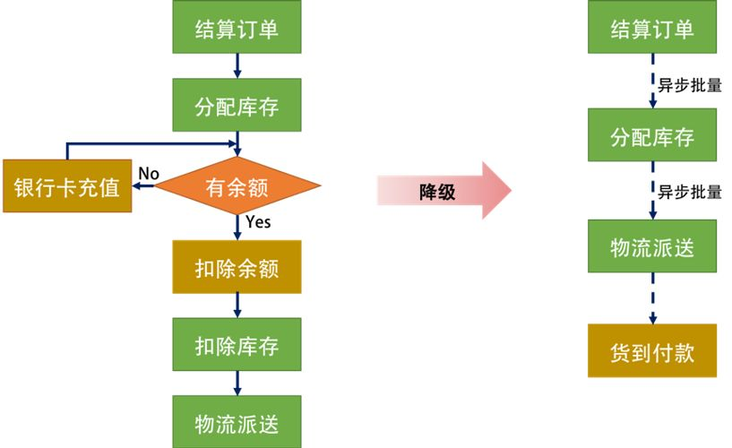

# 50-弹力设计篇之“降级设计”

所谓的降级设计（Degradation），本质是为了解决资源不足和访问量过大的问题。当资源和访问量出现矛盾的时候，在有限的资源下，为了能够扛住大量的请求，我们就需要对系统进行降级操作。也就是说，暂时牺牲掉一些东西，以保障整个系统的平稳运行。

我记得我在伦敦参与诺丁山狂欢节的时候，以及看阿森纳英超足球比赛的时候，散场时因为人太多，所有的公交系统（公交车，地铁）完全免费，就是为了让人通行得更快。而且早在散场前，场外就备着一堆公交车和地铁了，这样就是为了在最短时间内把人疏散掉。

虽然亏掉了一些钱，但是相比因为人员拥塞造成道路交通拥塞以及还可能出现的一些意外情况所造成的社会成本的损失，公交免费策略真是很明智的做法。与此类似，我们的系统在应对一些突发情况的时候也需要这样的降级流程。

一般来说，我们的降级需要牺牲掉的东西有：

- **降低一致性**。从强一致性变成最终一致性。
- **停止次要功能**。停止访问不重要的功能，从而释放出更多的资源。
- **简化功能**。把一些功能简化掉，比如，简化业务流程，或是不再返回全量数据，只返回部分数据。

# 降低一致性

我们要清楚地认识到，这世界上大多数系统并不是都需要强一致性的。对于降低一致性，把强一致性变成最终一致性的做法可以有效地释放资源，并且让系统运行得更快，从而可以扛住更大的流量。一般来说，会有两种做法，一种是简化流程的一致性，一种是降低数据的一致性。

## 使用异步简化流程

举个例子，比如电商的下单交易系统，在强一致的情况下，需要结算账单，扣除库存，扣除账户上的余额（或发起支付），最后进行发货流程，这一系列的操作。

如果需要是强一致性的，那么就会非常慢。尤其是支付环节可能会涉及银行方面的接口性能，就像双11那样，银行方面出问题会导致支付不成功，而订单流程不能往下走。

在系统降级时，我们可以把这一系列的操作做成异步的，快速结算订单，不占库存，然后把在线支付降级成用户到付，这样就省去支付环节，然后批量处理用户的订单，向用户发货，用户货到付款。

如上图所示，一开始需要的全同步的方式，降级成了全异步的方式，库存从单笔强一致性也变成了多笔最终一致性，如果库存不够了，就只能根据先来后到取消订单了。而支付也从最开始的下单请求时的强一致性，变成了用户到付的最终一致性。

一般来说，功能降级都有可能会损害用户的体验，所以，最好给出友好的用户提示。比如，“系统当前繁忙，您的订单已收到，我们正努力为您处理订单中，我们会尽快给您发送订单确认通知……还请见谅”诸如此类的提示信息。

## 降低数据的一致性

降低数据的一致性一般来说会使用缓存的方式，或是直接就去掉数据。比如，在页面上不显示库存的具体数字，只显示有还是没有库存这两种状态。

对于缓存来说，可以有效地降低数据库的压力，把数据库的资源交给更重要的业务，这样就能让系统更快速地运行。

对于降级后的系统，不再通过数据库获取数据，而是通过缓存获取数据。关于缓存的设计模式，我在CoolShell中有一篇叫《缓存更新的套路》的文章中讲述过缓存的几种更新模式，你有兴趣的话可以前往一读。在功能降级中，我们一般使用Cache Aside模式或是Read Through模式。也就是下图所示的这个策略。

- **失效**：应用程序先从cache取数据，如果没有得到，则从数据库中取数据，成功后，放到缓存中。
- **命中**：应用程序从cache中取数据，取到后返回。
- **更新**：先把数据存到数据库中，成功后，再让缓存失效。

Read Through 模式就是在查询操作中更新缓存，也就是说，当缓存失效的时候（过期或LRU换出），Cache Aside是由调用方负责把数据加载到缓存，而Read Through则用缓存服务自己来加载，从而对应用方是透明的。

# 停止次要的功能

停止次要的功能也是一种非常有用的策略。把一些不重要的功能给暂时停止掉，让系统释放出更多的资源来。比如，电商中的搜索功能，用户的评论功能，等等。等待访问的峰值过去后，我们再把这些功能给恢复回来。

当然，最好不要停止次要的功能，首先可以限制次要的功能的流量，或是把次要的功能退化成简单的功能，最后如果量太大了，我们才会进入停止功能的状态。

停止功能对用户会带来一些用户体验的问题，尤其是要停掉一些可能对于用户来说是非常重要的功能。所以，如果可能，最好给用户一些补偿，比如把用户切换到一个送积分卡，或是红包抽奖的网页上，有限地补偿一下用户。

# 简化功能

关于功能的简化上，上面的下单流程中已经提到过相应的例子了。而且，从缓存中返回数据也是其中一个。这里再提一个，就是一般来说，一个API会有两个版本，一个版本返回全量数据，另一个版本只返回部分或最小的可用的数据。

举个例子，对于一篇文章，一个API会把商品详情页或文章的内容和所有的评论都返回到前端。那么在降级的情况下，我们就只返回商品信息和文章内容，而不返回用户评论了，因为用户评论会涉及更多的数据库操作。

所以，这样可以释放更多的数据资源。而商品信息或文章信息可以放在缓存中，这样又能释放出更多的资源给交易系统这样的需要更多数据库资源的业务使用。

# 降级设计的要点

对于降级，一般来说是要牺牲业务功能或是流程，以及一致性的。所以，我们需要对业务做非常仔细的梳理和分析。我们很难通过不侵入业务的方式来做到功能降级。

在设计降级的时候，需要清楚地定义好降级的关键条件，比如，吞吐量过大、响应时间过慢、失败次数多过，有网络或是服务故障，等等，然后做好相应的应急预案。这些预案最好是写成代码可以快速地自动化或半自动化执行的。

功能降级需要梳理业务的功能，哪些是must-have的功能，哪些是nice-to-have的功能；哪些是必须要死保的功能，哪些是可以牺牲的功能。而且需要在事前设计好可以简化的或是用来应急的业务流程。当系统出问题的时候，就需要走简化应急流程。

降级的时候，需要牺牲掉一致性，或是一些业务流程：对于读操作来说，使用缓存来解决，对于写操作来说，需要异步调用来解决。并且，我们需要以流水账的方式记录下来，这样方便对账，以免漏掉或是和正常的流程混淆。

降级的功能的开关可以是一个系统的配置开关。做成配置时，你需要在要降级的时候推送相应的配置。另一种方式是，在对外服务的API上有所区分（方法签名或是开关参数），这样可以由上游调用者来驱动。

比如：一个网关在限流时，在协议头中加入了一个限流程度的参数，让后端服务能知道限流在发生中。当限流程度达到某个值时，或是限流时间超过某个值时，就自动开始降级，直到限流好转。

对于数据方面的降级，需要前端程序的配合。一般来说，前端的程序可以根据后端传来的数据来决定展示哪些界面模块。比如，当前端收不到商品评论时，就不展示。为了区分本来就没有数据，还是因为降级了没有数据的两种情况，在协议头中也应该加上降级的标签。

因为降级的功能平时不会总是会发生，属于应急的情况，所以，降级的这些业务流程和功能有可能长期不用而出现bug或问题，对此，需要在平时做一些演练。

# 小结

好了，我们来总结一下今天分享的主要内容。首先，降级设计本质上是为了解决资源不足和访问量过大的问题。降级的方法有降低一致性、停止次要功能和简化功能。最后，我总结了降级设计的要点。下篇文章中，我将总结整个弹力设计篇。希望对你有帮助。

也欢迎你分享一下你实现过怎样的降级机制？有没有和限流机制配合？

文末给出了《分布式系统设计模式》系列文章的目录，希望你能在这个列表里找到自己感兴趣的内容。

- 弹力设计篇
  - [认识故障和弹力设计](https://time.geekbang.org/column/article/3912)
  - [隔离设计Bulkheads](https://time.geekbang.org/column/article/3917)
  - [异步通讯设计Asynchronous](https://time.geekbang.org/column/article/3926)
  - [幂等性设计Idempotency](https://time.geekbang.org/column/article/4050)
  - [服务的状态State](https://time.geekbang.org/column/article/4086)
  - [补偿事务Compensating Transaction](https://time.geekbang.org/column/article/4087)
  - [重试设计Retry](https://time.geekbang.org/column/article/4121)
  - [熔断设计Circuit Breaker](https://time.geekbang.org/column/article/4241)
  - [限流设计Throttle](https://time.geekbang.org/column/article/4245)
  - [降级设计degradation](https://time.geekbang.org/column/article/4252)
  - [弹力设计总结](https://time.geekbang.org/column/article/4253)
- 管理设计篇
  - [分布式锁Distributed Lock](https://time.geekbang.org/column/article/5175)
  - [配置中心Configuration Management](https://time.geekbang.org/column/article/5819)
  - [边车模式Sidecar](https://time.geekbang.org/column/article/5909)
  - [服务网格Service Mesh](https://time.geekbang.org/column/article/5920)
  - [网关模式Gateway](https://time.geekbang.org/column/article/6086)
  - [部署升级策略](https://time.geekbang.org/column/article/6283)
- 性能设计篇
  - [缓存Cache](https://time.geekbang.org/column/article/6282)
  - [异步处理Asynchronous](https://time.geekbang.org/column/article/7036)
  - [数据库扩展](https://time.geekbang.org/column/article/7045)
  - [秒杀Flash Sales](https://time.geekbang.org/column/article/7047)
  - [边缘计算Edge Computing](https://time.geekbang.org/column/article/7086)