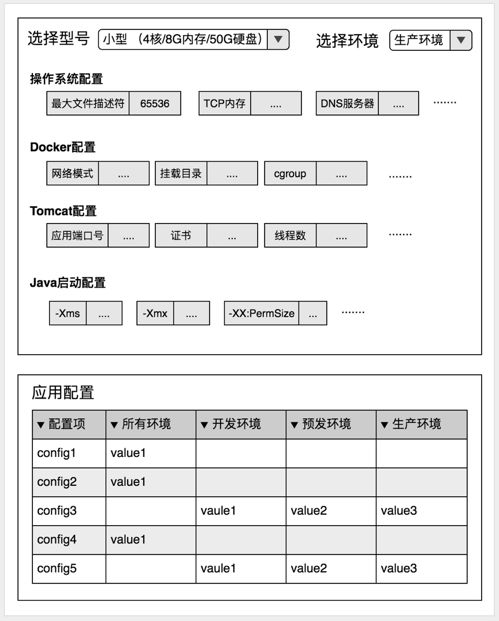

# 53-管理设计篇之“配置中心”

我们知道，除了代码之外，软件还有一些配置信息，比如数据库的用户名和密码，还有一些我们不想写死在代码里的东西，像线程池大小、队列长度等运行参数，以及日志级别、算法策略等，还有一些是软件运行环境的参数，如Java的内存大小，应用启动的参数，包括操作系统的一些参数配置……

所有这些东西，我们都叫做软件配置。以前，我们把软件配置写在一个配置文件中，就像Windows下的ini文件，或是Linux下的conf文件。然而，在分布式系统下，这样的方式就变得非常不好管理，并容易出错。于是，为了便于管理，我们引入了一个集中式的配置管理系统，这就是配置中心的由来。

现在，软件的配置中心是分布式系统的一个必要组件。这个系统听起来很简单，但其实并不是。我见过好多公司的配置中心，但是我觉得做得都不好，所以，想写下这篇文章给你一些借鉴。

# 配置中心的设计

## 区分软件的配置

首先，我们要区分软件的配置，软件配置的区分有多种方式。

有一种方式是把软件的配置分成静态配置和动态配置。所谓静态配置其实就是在软件启动时的一些配置，运行时基本不会进行修改，也可以理解为是环境或软件初始化时需要用到的配置。

例如，操作系统的网络配置，软件运行时Docker进程的配置，这些配置在软件环境初始化时就确定了，未来基本不会修改了。而所谓动态配置其实就是软件运行时的一些配置，在运行时会被修改。比如，日志级别、降级开关、活动开关。

当然，我们这里的内容主要针对动态配置的管理。

对于动态配置的管理，我们还要做好区分。一般来说，会有三个区分的维度。

- **按运行环境分**。一般来说，会有开发环境、测试环境、预发环境、生产环境。这些环境上的运行配置都不完全一样，但是理论来说，应该是大同小异的。
- **按依赖区分**。一种是依赖配置，一种是不依赖的内部配置。比如，外部依赖的MySQL或Redis的连接配置。还有一种完全是自己内部的配置。
- **按层次分**。就像云计算一样，配置也可以分成IaaS、PaaS、SaaS三层。基础层的配置是操作系统的配置，中间平台层的配置是中间件的配置，如Tomcat的配置，上层软件层的配置是应用自己的配置。

这些分类方式其实是为了更好地管理我们的配置项。小公司无所谓，而当一个公司变大了以后了，如果这些东西没有被很好地管理起来，那么会增加太多系统维护的复杂度。

## 配置中心的模型

有了上面为配置项的分类，我们就可以设计软件配置模型了。

首先，软件配置基本上来说，每个配置项就是key/value的模型。

然后，我们把软件的配置分成三层。操作系统层和平台层的配置项得由专门的运维人员或架构师来配置。其中的value应该是选项，而不是让用户可以自由输入的，最好是有相关的模板来初始化全套的配置参数。而应用层的配置项，需要有相应的命名规范，最好有像C++那样的名字空间的管理，确保不同应用的配置项不会冲突。

另外，我们的配置参数中，如果有外部服务依赖的配置，强烈建议不要放在配置中心里，而要放在服务发现系统中。因为一方面这在语义上更清楚一些，另外，这样会减少因为运行不同环境而导致配置不同的差异性（如测试环境和生产环境的不同）。

对于不同运行环境中配置的差异来说，比如在开发环境和测试环境下，日志级别是Debug级，对于生产环境则是Warning或Error级，因为环境的不一样，会导致我们需要不同的配置项的值。这点需要考虑到。

还有，我们的配置需要有一个整体的版本管理，每次变动都能将版本差异记录下来。当然，如果可能，最好能和软件的版本号做关联。

我们可以看到，其中有些配置是通过模板来选择的，有的配置需要在不同环境下配置不同值。所以，还需要一个配置管理的工具，可能是命令行的，也可以是Web的。这个工具的界面在文本中（下面这个UI的mockup只是想表明一个模型）。

用户可以根据不同的机器型号还有不同的环境直接调出后台配置好的相关标准配置的模板。对于一些用户需要自己调整的参数也可以在这个模板上进行调整和配置（当然，为了方便运维和管理最好不要进行调整）。然后，用户可以在下面的那个表格中填写好自己的应用要用的参数和各个环境中的值。

这样一来，这个工具就可以非常方便地让开发人员来配置他们自己的软件配置。而我们的配置中心还需要提API来让应用获取配置。这个API上至少需要有如下参数：服务名，配置的版本号，配置的环境。

## 配置中心的架构

接下来，要来解决配置落地的问题。我们可以看到，和一个软件运行有关系的各种配置隶属于不同的地方，所以，要让它们落地还需要些不一样的细节要处理。文本中，我们给了一个大概的架构图。

在这个图中可以看到，我们把配置录入后，配置中心发出变更通知，配置变更控制器会来读取最新的配置，然后应用配置。这看上去很简单，但是有很多细节问题，下面我来一一说明。

- **为什么需要一个变更通知的组件，而不是让配置中心直接推送？** 原因是，分布式环境下，服务器太多，推送不太现实，而采用一个Pub/Sub的通知服务可以让数据交换经济一些。
- **为什么不直接Pub数据过去，还要订阅方反向拉数据？** 直接推数据当然可以，但让程序反过来用API读配置的好处是，一方面，API可以校验请求者的权限，另一方面，有时候还是需要调用配置中心的基本API，比如下载最新的证书之类的。还有就是，服务启动时需要从服务中心拉一份配置下来。
- **配置变更控制器部署在哪里？是在每个服务器上呢，还是在一个中心的地方？** 我觉得因为这个事是要变更配置，变更配置又是有很多步骤的，所以这些步骤算是一个事务。为了执行效率更好，事务成功率更大，建议把这个配置变更的控制放在每一台主机上。
- **平台层的配置变更，有的参数是在服务启动的命令行上，这个怎么变更呢？** 一般来说，命令行上的参数需要通过Shell环境变量做成配置项，然后通过更改系统环境变量，并重启服务达到配置变更。
- **操作系统的配置变更和平台层的配置变更最好模块化掉，就像云服务中的不同尺寸的主机型号一样。** 这样有利于维护和减少配置的复杂性。
- **应用服务配置更新的标准化。** 因为一个公司的应用由不同的团队完成，所以，可能其配置会因为应用的属性不同而不一样。为了便于管理，最好有统一的配置更新。一般来说，有的应用服务的配置是在配置文件中，有的应用服务的配置是通过调用Admin API的方式变更，不同的应用系统完全不一样，你似乎完全没有方法做成统一的。这里给几个方案。
- 可以通过一个开发框架或SDK的方式来解决，也就是应用代码找你这个SDK来要配置，并通过observer模式订阅配置修改的事件，或是直接提供配置变更的Admin 的 API。这种方式的好处在于在开发期标准化，并可以规范开发；不好的是，耦合语言。
- 通过一个标准应用运维脚本，让应用方自己来提供应用变更时的脚本动作。这种方式虽然通过运维的方式标准化掉配置变更的接口，就可以通过一个配置控制器来统一操作各个应用变更，但是在这个脚本中各个应用方依然使用着各种不同的方式来变更配置。这种方式的好处是不耦合语言，灵活，但对于标准化的建设可能不利，而且使用或者调用脚本是Bug很多的东西，容易出问题。
- 或是结合上述两种方案，不使用开发阶段的SDK方式嵌入到应用服务中，而是为每个应用服务单独做一个Agent。这个Agent对外以Admin API的方式服务，后面则适配应用的配置变更手段，如更新配置文件，或者调用应用的API等。这种方式在落地方面是很不错的（这其中是另一种设计模式，后面会讲到）。

# 配置中心的设计重点

配置中心主要的用处是统一和规范化管理所有的服务配置，也算是一种配置上的治理活动。所以，配置中心的设计重点应该放在如何统一和标准化软件的配置项，其还会涉及到软件版本、运行环境、平台、中间件等一系列的配置参数。如果你觉得软件配置非常复杂，那么，你应该静下心来仔细梳理或治理一下现有的配置参数，并简化相应的配置，使用模块会是一种比较好的简化手段。

根据我们前面《编程范式游记》中所说的，编程的本质是对logic和control的分离，所以，对于配置也一样，其也有控制面上的配置和业务逻辑面上的配置，控制面上的配置最好能标准统一。

配置更新的时候是一个事务处理，需要考虑事务的问题，如果变更不能继续，需要回滚到上个版本的配置。配置版本最好和软件版本对应上。

配置更新控制器，需要应用服务的配合，比如，配置的reload，服务的优雅重启，服务的Admin API，或是通过环境变量……这些最好是由一个统一的开发框架搞定。

配置更新控制器还担任服务启动的责任，由配置更新控制器来启动服务。这样，配置控制器会从配置中心拉取所有的配置，更新操作系统，设置好启动时用的环境变量，并更新好服务需要的配置文件 ，然后启动服务。（当然，你也可以在服务启动的脚本中真正启动服务前放上一段让配置更新控制器更新配置的脚本。无论怎么样，这些都可以在运维层面实现，不需要业务开发人员知道。）

# 小结

好了，我们来总结一下今天分享的主要内容。首先，传统单机软件的配置通常保存在文件中，但在分布式系统下，为了管理方便，必须有一个配置中心。然后我讲了配置的区分：按静态和动态、运行环境、依赖和层次来区分。进一步，从区分出的情况出发，层次方面，平台、中间件和应用三个层次由不同职责的运维人员来配置。

外部依赖的配置并不适合放在配置中心里，而最好是由服务发现系统来提供。开发环境和生产环境的日志级别配置也会不同。出于这些特点，可以用一个配置管理工具来管理这些配置。接着，我介绍了配置管理架构中几个关键问题的解决思路。最后，我介绍了配置中心的几个设计重点。下篇文章中，我们讲述边车模式。希望对你有帮助。

也欢迎你分享一下你的分布式系统用到了配置中心吗？它是怎样实现的呢？配置的动态更新是怎么处理的？有没有版本管理，和服务的版本又是怎样关联的呢？

文末给出了《分布式系统设计模式》系列文章的目录，希望你能在这个列表里找到自己感兴趣的内容。

- 弹力设计篇
  - [认识故障和弹力设计](https://time.geekbang.org/column/article/3912)
  - [隔离设计Bulkheads](https://time.geekbang.org/column/article/3917)
  - [异步通讯设计Asynchronous](https://time.geekbang.org/column/article/3926)
  - [幂等性设计Idempotency](https://time.geekbang.org/column/article/4050)
  - [服务的状态State](https://time.geekbang.org/column/article/4086)
  - [补偿事务Compensating Transaction](https://time.geekbang.org/column/article/4087)
  - [重试设计Retry](https://time.geekbang.org/column/article/4121)
  - [熔断设计Circuit Breaker](https://time.geekbang.org/column/article/4241)
  - [限流设计Throttle](https://time.geekbang.org/column/article/4245)
  - [降级设计degradation](https://time.geekbang.org/column/article/4252)
  - [弹力设计总结](https://time.geekbang.org/column/article/4253)
- 管理设计篇
  - [分布式锁Distributed Lock](https://time.geekbang.org/column/article/5175)
  - [配置中心Configuration Management](https://time.geekbang.org/column/article/5819)
  - [边车模式Sidecar](https://time.geekbang.org/column/article/5909)
  - [服务网格Service Mesh](https://time.geekbang.org/column/article/5920)
  - [网关模式Gateway](https://time.geekbang.org/column/article/6086)
  - [部署升级策略](https://time.geekbang.org/column/article/6283)
- 性能设计篇
  - [缓存Cache](https://time.geekbang.org/column/article/6282)
  - [异步处理Asynchronous](https://time.geekbang.org/column/article/7036)
  - [数据库扩展](https://time.geekbang.org/column/article/7045)
  - [秒杀Flash Sales](https://time.geekbang.org/column/article/7047)
  - [边缘计算Edge Computing](https://time.geekbang.org/column/article/7086)