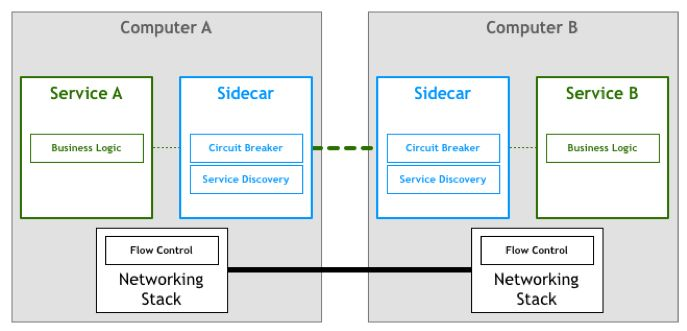
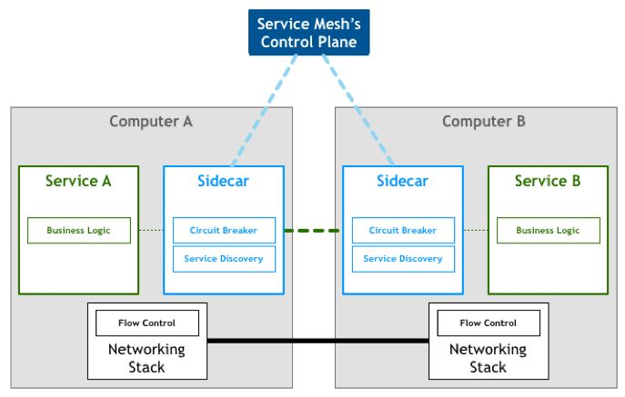
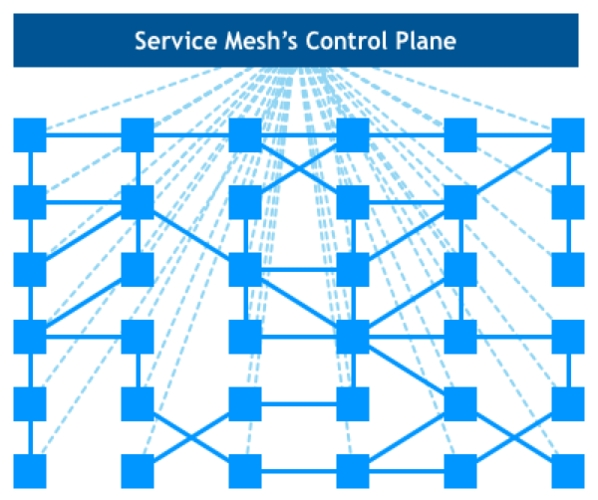
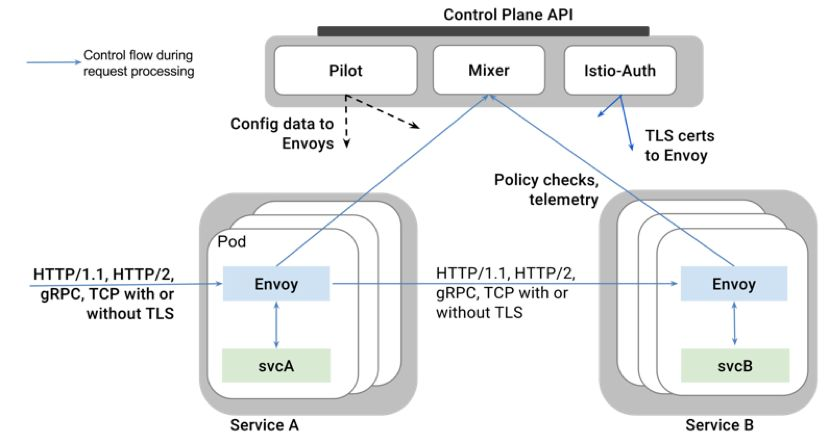

# 55-管理设计篇之“服务网格”

前面，我讨论了Sidecar边车模式，这是一个非常不错的分布式架构的设计模式。因为这个模式可以有效地分离系统控制和业务逻辑，并且可以让整个系统架构在控制面上可以集中管理，可以显著地提高分布式系统的整体控制和管理效率，并且可以让业务开发更快速。

那么，我们不妨在上面这个模式下think big一下。假如，我们在一个分布式系统中，已经把一些标准的Sidecar给部署好了。比如前面文章说过的熔断、限流、重试、幂等、路由、监视等这些东西。我们在每个计算结点上都部署好了这些东西，那么真实的业务服务只需要往这个集群中放，就可以和本地的Sidecar通信，然后由Sidecar委托代理与其它系统的交互和控制。这样一来，我们的业务开发和运维岂不是简单之极了？

是啊，试想一下，如果某云服务提供商，提供了一个带着前面我们说过的那些各式各样的分布式设计模式的Sidecar集群，那么我们的用户真的就只用写业务逻辑相关的service了。写好一个就往这个集群中部署，开发和运维工作量都会得到巨大的降低和减少。

## 什么是Service Mesh

这就是CNCF（Cloud Native Computing Foundation，云原生计算基金会）目前主力推动的新一代的微服务架构——Service Mesh服务网格。

在[What’s a service mesh? And why do I need one?](https://buoyant.io/2017/04/25/whats-a-service-mesh-and-why-do-i-need-one/) 中，解释了什么是Service Mesh。

A service mesh is a dedicated infrastructure layer for handling service-to-service communication. It’s responsible for the reliable delivery of requests through the complex topology of services that comprise a modern, cloud native application. In practice, the service mesh is typically implemented as an array of lightweight network proxies that are deployed alongside application code, without the application needing to be aware.

Service Mesh这个服务网络专注于处理服务和服务间的通讯。其主要负责构造一个稳定可靠的服务通讯的基础设施，并让整个架构更为的先进和Cloud Native。在工程中，Service Mesh基本来说是一组轻量级的服务代理和应用逻辑的服务在一起，并且对于应用服务是透明的。

说白了，就是下面几个特点。

- Service Mesh是一个基础设施。
- Service Mesh是一个轻量的服务通讯的网络代理。
- Service Mesh对于应用服务来说是透明无侵入的。
- Service Mesh用于解耦和分离分布式系统架构中控制层面上的东西。

说起来，Service Mesh就像是网络七层模型中的第四层TCP协议。其把底层的那些非常难控制的网络通讯方面的控制面的东西都管了（比如：丢包重传、拥塞控制、流量控制），而更为上面的应用层的协议，只需要关心自己业务应用层上的事了。如HTTP的HTML协议。

[Pattern: Service Mesh](http://philcalcado.com/2017/08/03/pattern_service_mesh.html) 这篇文章里也详细解释了Service Mesh的出现并不是一个偶然，而是一个必然，其中的演化路径如下。

- 一开始是最原始的两台主机间的进程直接通信。
- 然后分离出网络层来，服务间的远程通信，通过底层的网络模型完成。
- 再后来，因为两边的服务在接收的速度上不一致，所以需要应用层中实现流控。
- 后来发现，流控模块基本可以交给网络层实现，于是TCP/IP就成了世界上最成功的网络协议。
- 再往后面，我们知道了分布式系统中的8个谬论 [The 8 Fallacies of Distributed Computing](https://en.wikipedia.org/wiki/Fallacies_of_distributed_computing) ，意识到需要在分布式系统中有"弹力设计"。于是，我们在更上层中加入了像限流、熔断、服务发现、监控等功能。
- 然后，我们发现这些弹力设计的模式都是可以标准化的。将这些模式写成SDK/Lib/Framework，这样就可以在开发层面上很容易地集成到我们的应用服务中。
- 接下来，我们发现，SDK、Lib、Framework不能跨编程语言。有什么改动后，要重新编译重新发布服务，太不方便了。应该有一个专门的层来干这事，于是出现了Sidecar。

图片来自[Pattern: Service Mesh](http://philcalcado.com/2017/08/03/pattern_service_mesh.html)

然后呢，Sidecar集群就成了Service Mesh。图中的绿色模块是真实的业务应用服务，蓝色模块则是Sidecar，其组成了一个网格。而我们的应用服务完全独立自包含，只需要和本机的Sidecar依赖，剩下的事全交给了Sidecar。

图片来自[Pattern: Service Mesh](http://philcalcado.com/2017/08/03/pattern_service_mesh.html)

于是 Sidecar组成了一个平台，一个Cloud Native的服务流量调度的平台（你是否还记得我在《分布式系统的本质》那一系列文章中所说的关键技术中的流量调度和应用监控，其都可以通过Service Mesh这个平台来完成）。

图片来自[Pattern: Service Mesh](http://philcalcado.com/2017/08/03/pattern_service_mesh.html)

加上对整个集群的管理控制面板，就成了我们整个的Service Mesh架构。

图片来自[Pattern: Service Mesh](http://philcalcado.com/2017/08/03/pattern_service_mesh.html)

图片来自[Pattern: Service Mesh](http://philcalcado.com/2017/08/03/pattern_service_mesh.html)

## Service Mesh相关的开源软件

目前比较流行的Service Mesh开源软件是 [Istio](https://istio.io/) 和 [Linkerd](https://linkerd.io/)，它们都可以在Kubernetes中集成。当然，还有一个新成员 [Conduit](https://conduit.io/)，它是由Linkerd的作者出来自己搞的，由Rust和Go写成的。Rust负责数据层面，Go负责控制面。号称吸取了很多Linkerd的Scala的教训，比Linkerd更快，还轻，更简单。

我虽然不是语言的偏好者，但是，不可否认Rust/Go的性能方面比Scala要好得多得多，尤其是要做成一个和网络通讯相关的基础设施，性能是比较重要的。

对此，我还是推荐大家使用Rust/Go语言实现的lstio和Conduit，后者比前者要轻很多。你可以根据你的具体需求挑选，或是自己实现。

lstio是目前最主流的解决方案，其架构并不复杂，其核心的Sidecar被叫做Envoy（使者），用来协调服务网格中所有服务的出入站流量，并提供服务发现、负载均衡、限流熔断等能力，还可以收集大量与流量相关的性能指标。

在Service Mesh控制面上，有一个叫Mixer的收集器，用来从Envoy收集相关的被监控到的流量特征和性能指标。然后，通过Pilot的控制器将相关的规则发送到Envoy中，让Envoy应用新的规则。

最后，还有一个为安全设计的lstio-Auth身份认证组件，用来做服务间的访问安全控制。

整个lstio的架构图如下。

## Service Mesh的设计重点

Service Mesh作为Sidecar一个集群应用，Sidecar需要的微观层面上的那些设计要点在这里就不再复述了，欢迎大家看我之前的文章。这里，更多地说一下Service Mesh在整体架构上的一些设计要点。

我们知道，像Kubernetes和Docker也是分布式系统管理面上的技术解决方案，它们一样对于应用程序是透明的。最重要的是，Kubernetes和Docker对于应用服务的干扰是比较少的。也就是说，Kubernetes和Docker的服务进程的失败不会导致应用服务的异常运行。然后，Service Mesh则不是，因为其调度了流量，所以，如果Service Mesh有bug，或是Sidecar的组件不可用，就会导致整个架构出现致命的问题。

所以，在设计Service Mesh的时候，我们需要小心考虑，如果Service Mesh所管理的Sidecar出了问题，那应该怎么办？所以，Service Mesh这个网格一定要是高可靠的，或者是出现了故障有workaround的方式。一种比较好的方式是，除了在本机有Sidecar，我们还可以部署一下稍微集中一点的Sidecar——比如为某个服务集群部署一个集中式的Sidecar。一旦本机的有问题，可以走集中的。

这样一来，Sidecar本来就是用来调度流量的，而且其粒度可以细到每个服务的实例，可以粗到一组服务，还可以粗到整体接入。这看来看去都像是一个Gateway的事。所以，我相信，使用Gateway来干这个事应该是最合适不过的了。这样，我们的Service Mesh的想像空间一下子就大多了。

Service Mesh不像Sidecar需要和Service一起打包一起部署，Service Mesh完全独立部署。这样一来，Service Mesh就成了一个基础设施，就像一个PaaS平台。所以，Service Mesh能不能和Kubernetes密切结合就成为了非常关键的因素。

## 小结

好了，我们来总结一下今天分享的主要内容。首先，边车模式进化的下一阶段，就是把它的功能标准化成一个集群，其结果就是服务网格。它在分布式系统中的地位，类似于七层网络模型中的传输层协议，而服务本身则只需要关心业务逻辑，因此类似于应用层协议。然后，我介绍了几个实现了服务网格的开源软件。最后，我介绍了服务网格的几个设计重点。下篇文章中，我们讲述网关模式。希望对你有帮助。

也欢迎你分享一下你接触到的分布式系统有没有用到服务网格？具体用的是哪个开源或闭源的框架？

文末给出了《分布式系统设计模式》系列文章的目录，希望你能在这个列表里找到自己感兴趣的内容。

- 弹力设计篇
  - [认识故障和弹力设计](https://time.geekbang.org/column/article/3912)
  - [隔离设计Bulkheads](https://time.geekbang.org/column/article/3917)
  - [异步通讯设计Asynchronous](https://time.geekbang.org/column/article/3926)
  - [幂等性设计Idempotency](https://time.geekbang.org/column/article/4050)
  - [服务的状态State](https://time.geekbang.org/column/article/4086)
  - [补偿事务Compensating Transaction](https://time.geekbang.org/column/article/4087)
  - [重试设计Retry](https://time.geekbang.org/column/article/4121)
  - [熔断设计Circuit Breaker](https://time.geekbang.org/column/article/4241)
  - [限流设计Throttle](https://time.geekbang.org/column/article/4245)
  - [降级设计degradation](https://time.geekbang.org/column/article/4252)
  - [弹力设计总结](https://time.geekbang.org/column/article/4253)
- 管理设计篇
  - [分布式锁Distributed Lock](https://time.geekbang.org/column/article/5175)
  - [配置中心Configuration Management](https://time.geekbang.org/column/article/5819)
  - [边车模式Sidecar](https://time.geekbang.org/column/article/5909)
  - [服务网格Service Mesh](https://time.geekbang.org/column/article/5920)
  - [网关模式Gateway](https://time.geekbang.org/column/article/6086)
  - [部署升级策略](https://time.geekbang.org/column/article/6283)
- 性能设计篇
  - [缓存Cache](https://time.geekbang.org/column/article/6282)
  - [异步处理Asynchronous](https://time.geekbang.org/column/article/7036)
  - [数据库扩展](https://time.geekbang.org/column/article/7045)
  - [秒杀Flash Sales](https://time.geekbang.org/column/article/7047)
  - [边缘计算Edge Computing](https://time.geekbang.org/column/article/7086)