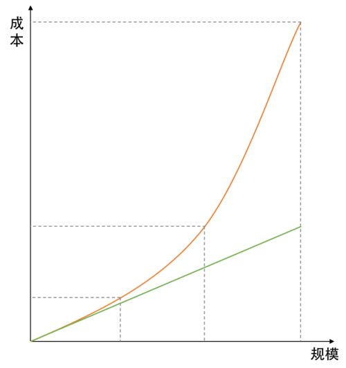

# 62-性能设计篇之“边缘计算”

前面我们通过一个秒杀的示例，展示了如何在CDN结点上简单地部署小服务，然后就可以完成在数据中心很难完成的事，我想你应该能看到边缘结点的一些威力。今天，我会和你聊聊我所认识的边缘计算，这也是我创业的方向。

首先，一说起边缘计算，网上大多数文章都会说这是和IoT相关的一个技术。其实，我觉得这个说法只说对了边缘计算的一部分，边缘计算可以做的事情还有很多很多。

所谓边缘计算，它是相对于数据中心而言。数据中心喜欢把所有的服务放在一个机房里集中处理用户的数据和请求，集中式部署一方面便于管理和运维，另一方面也便于服务间的通讯有一个比较好的网络保障。的确没错。不过，我们依然需要像CDN这样的边缘式的内容发布网络，把我们的静态内容推到离用户最近的地方，然后获得更好的性能。

如果我们让CDN的这些边缘结点拥有可定制的计算能力，那么就可以像秒杀那样，可以在边缘结点上处理很多事情，从而为我们的数据中心带来更好的性能，更好的扩展性，还有更好的稳定性。而我们的用户也会觉得响应飞快，从而有了更好的用户体验。

下面，让我们来看看为什么边缘计算会变成一个必然的产物。这里，我有两个例子。

# 为什么要有边缘计算

## 从趋势上来说

首先，我们得看一下整个时代是怎么发展的。我们处在信息化革命时代，也有人叫数字化革命，总之就是电脑时代。这个时代，把各式各样的信息都给数字化掉，然后交给计算机来处理。所以，我们要清楚地知道，**整个计算机发展的本质就是我们人类生活信息化建设的过程**。

这个过程中，计算机硬件的发展也是非常迅猛的。CPU的处理速度，硬盘的大小和速度，网络的带宽和速度都在拼命地升级和降价。我们用越来越低的成本，获得越来越快的速度、越来越大的带宽、越来越快的存储……

所有的这一切，其实都是和信息还有数据有关。我们的信息和数据越来越多，越来越大，所以，我们需要更好、更快、更便宜的硬件和基础设施。这个演化过程中，在我参加工作这20年来就没有停止过，而且，我也不认为未来会停下来，这个过程只会越来越快。

下面是我画的一个时代的变更图（不用太纠结其中的时间点，我只是想表示信息演进的过程）

从一开始，我们处在MB时代，那个时候，电脑也是几百兆的硬盘就够了。因为那个时候的信息量不够大，只有内容服务提供商在提供内容，他们主要以新闻资讯为主，所以数据还不多。

然后，开始进入UGC时代，用户开始产生数据，他们写博客，发贴子，拍照片，拍视频……于是，信息越来越多，于是我们的数据进入了GB时代，于是计算机的硬件，网络的基础设施都在升级。

再然后，我们进入了大数据时代，这个时代也是移动互联网的时代。以前你要打开电脑才能上网，现在你只要手机有电，你就是在线的，而且这个时代，大量的线下服务走到线上，比如外卖、叫车……于是，有各种各样的App在收集你的行为和数据。这个时候，是计算机在记录每个人的上网行为的时候，所以，数据量也不是一般的大。

然后，这个趋势只会越来越大，下一个时间，我们的数据和信息只会越来越大，因为计算机正在吞噬可以被数字化的一切事情。除了继续吞噬线上的业务，一定会开始吞噬线下的信息和数据。比如，通过摄像头识别线下的各种活动，如车牌；通过一些传感器来收集线下的各种数据，如农业、水利……于是，数据只会变得越来越大。

这个时候，我们想一想，如果把这么大量的数据都拿到数据中心来做分析和计算，一个数据中心顶得住吗？我现在已经接到好几个用户和我说，数据量太大了，不知道怎么架构数据中心了，各种慢，各种贵，各种痛苦……

而且，还有另外一个需求就是要实时，对于大数据处理的实时需求越来越成为刚需了，因为，如果不能实时处理、实时响应，那么怎么能跟得上这个快速的时代呢。这就好像一个人脸识别的功能。如果苹果手机的人脸识别需要到服务器上算，然后把结果返回，那么用户的体验就很糟糕了。这就是为什么苹果在手机里直接植入了神经网络的芯片。

**我们可以看到，数量越来越大，分析结果的速度需要越来越快，这两个需求，只会把我们逼到边缘计算上去。** 如果你还是在数据中心处理，你会发现你的成本只会越来越高，到一定时候就完全玩不下去了。

## 从成本上来说

上面这个是第一个示例，我们再来看看数据中心的成本，当一个公司需要支持几十万用户的时候，并没有什么感觉。当他们要支撑上千万乃至上亿用户的时候，我们就会发现，一个几十万用户的系统架构和一个支撑上千万用户的架构，在成本上来说，完全不是一个数量级的。就像文本中的图片所描述的那样（只是一个草图，用于说明问题）。

在这个图中，我们可以看到，当需要处理的数据或是用户请求的规模越来越大时，我们的成本是呈现快速上升的曲线，而不是一个线性上升的成本关系。

我们可以来算一下，根据我过去服务过的40多家公司的经验，可以看到如下的投入：

- 几十万用户的公司，只需要处理百级QPS的量，只需要10台左右的服务器；
- 上百万用户的公司，只需要处理千级QPS的量，需要有50台左右的服务器；
- 上千万用户的公司，需要处理万级到十万级QPS的量，需要700台左右的服务器；
- 上亿用户的公司，其需要处理百万级QPS的量，需要上万台的服务器。

可以看到，十万用户到上亿用户，也就多了100倍，为什么服务器需要1000倍？完全不是呈线性的关系。

这时因为，当架构变复杂了后，你就要做很多非功能的东西了，比如，缓存、队列、服务发现、网关、自动化运维、监控等。

那么，我们不妨开个脑洞。如果我们能够把那上亿的用户拆成100个百万级的用户，那么只需要5000多台机器（100个50台服务器的数据中心）。

我们还是同样服务了这么多的用户，但我们的成本下降得很快。只不过，我们需要运维100个小数据中心。不过，相信我，运维100个50台服务器的小数据中心的难度应该远远低于运维一个10000台服务器的数据中心。

好了，问题来了，什么样的业务可以这么做？我觉得有地域性的业务是可以这么做的，比如：外卖、叫车、共享单车之类的。

然而，100个50台服务器的小数据中心也会带来一些复杂的问题，因为当你的公司有100万用户的时候的业务形态和有1亿用户的业务形态是完全不一样的，1亿用户的业务形态可能会复杂得多得多。也就是说，我们不可能在一个小数据中心只有50台服务器，因为那是百万用户的业务形态，只有几十个服务。当公司成长到上亿用户的规模时，可能会有上百个服务，50台服务器是不够部署的。

所以，我上面那种多个数据中心的理想只存在于理论上，而实际上不会发生。

但是，我们依然可以沿着这条路思考下去。我们不难发现，我们完全可以用边缘结点处理高峰流量，这样，我们的数据中心就不需要花那么大的成本来建设了。

于是，还是到了边缘计算。

# 边缘计算的业务场景

通过上面的两个案例分析，我觉得边缘计算一定会成为一个必然产物，其会作为以数据中心为主的云计算的一个非常好的补充。这个补充在我看来，其主要是做下面一些事情。

- 处理一些实时响应的业务。它和用户靠得很近，所以可以实时响应用户的一些本地请求，比如，某公司的人脸门禁系统、共享单车的开锁。
- 处理一些简单的业务逻辑。比如像秒杀、抢红包这样的业务场景。
- 收集并结构化数据。比如，把视频中的车牌信息抠出来，转成文字，传回数据中心。
- 实时设备监控。主要是线下设备的数据采集和监控。
- P2P的一些去中心化的应用。比如：边缘结点作为一个服务发现的服务器，可以让本地设备之间进行P2P通讯。
- 云资源调度。边缘结点非常适合用来做云端服务的调度。比如，允许用户使用不同生产商的云存储服务，使用不同生产商但是功能相同的API服务（比如支付API相关）。因为是流量接入方，所以可以调度流量。
- 云资源聚合。比如，我们可以把语音转文字的API和语义识别的API相结合，聚合出来一个识别语音语义的API，从而简化开发人员的开发成本。
- ……

其实还有很多，我觉得边缘计算带来的想象力还是很令人激动的。

关于现实当中的一些案例，你可以看看 [Netflix的全球边缘架构的PPT](https://www.slideshare.net/MikeyCohen1/edge-architecture-ieee-international-conference-on-cloud-engineering-32240146)。

# 边缘计算的关键技术

在我看来，边缘计算的关键技术如下。

- API Gateway。关于网关，这个就不说了，我们在管理设计篇中有一篇就是专门讨论这个东西的。
- Serverless/FaaS。就是服务函数化，这个技术就像是AWS Lambda服务一样，你写好一个函数，然后不用关心这个函数运行在哪里，直接发布就好了。然后就可以用了。

Serverless这个词第一次被使用大约是2012年由Ken Form所写的一篇名为《Why The Future of Software and Apps is Serverless》的文章。这篇文章谈到的内容是关于持续集成及源代码控制等，并不是我们今天所特指的这一种架构模式。

但Amazon在2014年发布的AWS Lambda让"Serverless"这一范式提高到一个全新的层面，为云中运行的应用程序提供了一种全新的系统体系结构。至此再也不需要在服务器上持续运行进程以等待HTTP请求或API调用，而是可以通过某种事件机制触发代码的执行。

通常，这只需要在AWS的某台服务器上配置一个简单的功能。此后Ant Stanley 在2015年7月的名为《Server are Dead…》的文章中更是围绕着AWS Lambda及刚刚发布的AWS API Gateway这两个服务解释了他心目中的Serverless，“Server are dead…they just don’t know it yet”。

如果说微服务是以专注于单一责任与功能的小型功能块为基础，利用模块化的方式组合出复杂的大型应用程序，那么我们还可以进一步认为Serverless架构可以提供一种更加"代码碎片化"的软件架构范式，我们称之为Function as a Services（FaaS）。所谓的“函数”（Function）提供的是相比微服务更加细小的程序单元。

目前比较流行的几个开源项目是：

- [Serverless Framework](https://github.com/serverless/serverless)
- [Fission: Serverless Functions for Kubernetes](https://github.com/fission/fission)
- [Open Lambda](https://github.com/open-lambda/open-lambda)
- [Open FaaS](https://github.com/openfaas/faas)
- [IronFunction](https://github.com/iron-io/functions)

# 小结

好了，我们来总结一下今天分享的主要内容。首先，我描绘了边缘计算的初始模样。接着，我讲了从计算的发展趋势上来看，数据量的不断增大迫使边缘计算成为一个必然。大数据中心的成本问题，也需要通过边缘计算来降低。然后，我列举了边缘计算的业务场景。最后，我介绍了实现边缘计算所需的关键技术。希望对你有帮助。

也欢迎你分享一下你对边缘计算的看法如何？有没有什么好的想法？

文末给出了《分布式系统设计模式》系列文章的目录，希望你能在这个列表里找到自己感兴趣的内容。

- 弹力设计篇
  - [认识故障和弹力设计](https://time.geekbang.org/column/article/3912)
  - [隔离设计Bulkheads](https://time.geekbang.org/column/article/3917)
  - [异步通讯设计Asynchronous](https://time.geekbang.org/column/article/3926)
  - [幂等性设计Idempotency](https://time.geekbang.org/column/article/4050)
  - [服务的状态State](https://time.geekbang.org/column/article/4086)
  - [补偿事务Compensating Transaction](https://time.geekbang.org/column/article/4087)
  - [重试设计Retry](https://time.geekbang.org/column/article/4121)
  - [熔断设计Circuit Breaker](https://time.geekbang.org/column/article/4241)
  - [限流设计Throttle](https://time.geekbang.org/column/article/4245)
  - [降级设计degradation](https://time.geekbang.org/column/article/4252)
  - [弹力设计总结](https://time.geekbang.org/column/article/4253)
- 管理设计篇
  - [分布式锁Distributed Lock](https://time.geekbang.org/column/article/5175)
  - [配置中心Configuration Management](https://time.geekbang.org/column/article/5819)
  - [边车模式Sidecar](https://time.geekbang.org/column/article/5909)
  - [服务网格Service Mesh](https://time.geekbang.org/column/article/5920)
  - [网关模式Gateway](https://time.geekbang.org/column/article/6086)
  - [部署升级策略](https://time.geekbang.org/column/article/6283)
- 性能设计篇
  - [缓存Cache](https://time.geekbang.org/column/article/6282)
  - [异步处理Asynchronous](https://time.geekbang.org/column/article/7036)
  - [数据库扩展](https://time.geekbang.org/column/article/7045)
  - [秒杀Flash Sales](https://time.geekbang.org/column/article/7047)
  - [边缘计算Edge Computing](https://time.geekbang.org/column/article/7086)