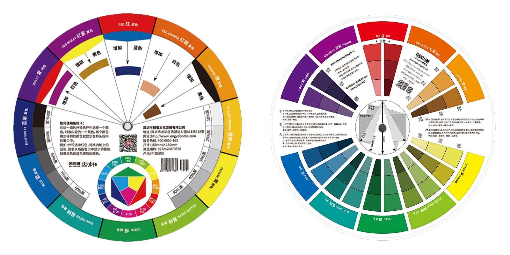

现代用户体验设计（User Experience Design，简称UX设计）借鉴了人类因素工程学（Human Factors Engineering）和工业设计（Industrial Design）中的实证原则，以确保产品的可用性、舒适性和整体用户满意度。以下是一些关键内容和原则：

### 1. 人类因素工程学（Human Factors Engineering）

**人类因素工程学**致力于理解人与系统的交互，确保设计符合人类生理、心理和认知特点。以下是一些关键原则：

#### 1.1 可用性（Usability）
- **简化任务**：减少用户完成任务所需的步骤和复杂度。
- **直观的界面**：设计应尽可能直观，用户可以轻松理解和使用。
- **一致性**：界面的元素和行为应保持一致，以便用户可以预测系统的反应。

#### 1.2 人机工效（Ergonomics）
- **舒适性**：设计考虑用户的身体舒适度，减少疲劳和不适。例如，合理的按钮大小和间距。
- **无障碍设计**：确保产品对各种用户群体（包括残障人士）都友好。例如，提供屏幕阅读器支持和高对比度选项。

#### 1.3 认知负荷（Cognitive Load）
- **减少认知负荷**：设计应尽量减少用户处理信息的负担。使用清晰的标签、简洁的界面和适当的信息层次结构。
- **提供反馈**：用户操作后应立即得到系统的反馈，确认操作成功或提示错误。

### 2. 工业设计（Industrial Design）

**工业设计**注重产品的美观性、功能性和用户体验。以下是一些关键原则：

#### 2.1 美观性（Aesthetics）
- **视觉吸引力**：设计应具有吸引力，使用户乐于使用。使用协调的色彩、对比和布局。
- **品牌一致性**：设计应与品牌形象一致，传达品牌价值和风格。

#### 2.2 功能性（Functionality）
- **实用性**：设计不仅要美观，还要实用。确保每个设计元素都有其功能意义。
- **易维护性**：设计应考虑产品的维护和更新，易于修复和升级。

#### 2.3 用户中心设计（User-Centered Design）
- **用户研究**：通过调查、访谈和用户测试了解用户需求和行为。
- **迭代设计**：根据用户反馈不断改进设计，进行原型测试和调整。
- **场景化设计**：考虑用户在不同场景下的使用情况，设计应适应多种使用环境。

### 3. 具体应用

**实证原则**通过具体方法和工具在UX设计中得以应用：

#### 3.1 用户调研与测试
- **用户调研**：使用问卷调查、用户访谈、焦点小组等方法收集用户需求和反馈。
- **可用性测试**：观察用户与产品的交互，识别问题并改进设计。
- **A/B测试**：比较不同设计版本的效果，选择最优方案。

#### 3.2 设计工具与方法
- **用户故事和角色模型**：创建用户故事和角色模型，帮助理解用户需求和行为。
- **线框图和原型**：使用线框图和原型快速测试和迭代设计，验证设计假设。
- **信息架构**：设计清晰的信息架构，确保用户可以轻松找到所需信息。

### 4. 实例分析

#### 4.1 移动应用设计
- **易用性**：简化导航和操作流程，减少用户输入。
- **视觉设计**：使用符合品牌形象的视觉元素，吸引用户注意力。
- **反馈机制**：提供即时的操作反馈，如按钮点击动画和加载指示器。

#### 4.2 网站设计
- **响应式设计**：确保网站在不同设备上的兼容性和良好显示。
- **内容布局**：合理安排内容布局，使用标题、段落和图像引导用户阅读。
- **互动设计**：设计直观的互动元素，如按钮、表单和菜单，提升用户体验。

通过结合人类因素工程学和工业设计的实证原则，现代UX设计能够创造出既美观又高效的产品，满足用户的多样化需求，提升用户满意度和品牌忠诚度。

## 使用协调的色彩、对比和布局，这有什么原则和规则吗？

在用户体验设计中，使用协调的色彩、对比和布局是至关重要的。这些元素的设计原则和规则可以帮助创建视觉上吸引人且易于使用的界面。以下是一些关键原则和规则：

### 色彩设计原则

1. **色彩协调**：
   
   - **色彩轮**：使用色彩轮来选择协调的颜色。相邻的颜色（类比色）、对比色（互补色）和三角配色方案（色轮上的三色等距）都是常见的选择。

     - 类比色：在色环图中，相邻的两色即为类似色。
   
     - 对比色：在色环图中，相对成180度，也就是直线两端的颜色，互为**补色**。 100度~179度称为**对比色**。
   
     - 暖色与冷色：在色环中，以绿和紫色两个中性色为界，红、橙、黄等为暖色，绿、蓝绿、蓝等为冷色。
   
       
   
   - **色彩调和**：选择颜色时，确保它们的色调和亮度协调一致。例如，使用同一色调的不同明度或饱和度的颜色。
   
2. **色彩对比**：
   
   - **对比度**：确保文本与背景之间有足够的对比度，提升可读性。Web Content Accessibility Guidelines（WCAG）建议正文文本与背景的对比度至少为4.5:1。
   - **强调色**：使用高对比度的颜色来突出重要元素，如按钮和链接。限制强调色的使用，以免分散用户注意力。
   
3. **色彩心理学**：
   - **情感传达**：不同颜色传达不同的情感和信息。例如，蓝色通常被认为是冷静和可信赖的，而红色则传达紧急和兴奋。
   - **文化差异**：不同文化对颜色的理解和反应不同，设计时需要考虑目标用户的文化背景。

### 对比设计原则

1. **视觉层次**：
   - **大小对比**：通过不同大小的元素来建立视觉层次，大的元素吸引更多注意力。
   - **粗细对比**：使用不同粗细的字体和线条来强调重要信息。

2. **颜色对比**：
   - **色相对比**：使用色相差异明显的颜色来区分不同的内容区域。
   - **明暗对比**：利用明暗对比（亮度差异）来突出关键内容和操作。

3. **形状对比**：
   - **不同形状**：使用不同形状的元素（如圆形按钮和方形输入框）来区分功能和信息。
   - **负空间**：合理使用负空间（空白区域）来分隔和突出内容，使界面更易于阅读和理解。

### 布局设计原则

1. **网格系统**：
   - **一致性**：使用网格系统来确保布局的一致性和对齐，提升整体视觉效果和用户体验。
   - **响应式设计**：设计响应式网格，确保界面在不同设备和屏幕尺寸上都能良好显示。

2. **视觉流**：
   - **F型和Z型布局**：基于用户自然的阅读模式，F型和Z型布局有助于引导用户的视线，提升信息传达效率。
   - **层次结构**：通过布局创建视觉层次，重要信息放在显眼的位置，引导用户注意力。

3. **对齐和间距**：
   - **对齐**：保持元素的对齐，创建有序感和一致性。使用左对齐、右对齐或居中对齐来确保整洁的外观。
   - **间距**：合理使用间距（边距和填充）来分隔内容，避免界面过于拥挤，提高可读性和可用性。

4. **可读性**：
   - **文本排版**：选择易读的字体和合适的字号，确保文本的可读性。使用行高和字距调整文本布局。
   - **段落分隔**：使用段落、标题和子标题分隔内容，提升文本的结构性和易读性。

### 实际应用中的示例

1. **色彩设计**：
   - 使用品牌的主要颜色作为背景色，搭配中性色（如白色或灰色）以增加对比。
   - 选择一种强调色用于按钮和链接，确保用户能够轻松识别可点击元素。

2. **对比设计**：
   - 在表单中，使用深色边框和浅色背景来区分输入框。
   - 在卡片设计中，使用阴影和高亮效果来增加深度和层次感。

3. **布局设计**：
   - 在网页布局中，使用12列网格系统来确保内容对齐和响应性。
   - 在移动应用中，采用F型布局，引导用户从上到下、从左到右浏览内容。

通过遵循这些色彩、对比和布局设计的原则和规则，可以创建出视觉上吸引人且功能性强的用户界面，提升用户体验和满意度。

## 十二色色环

十二色相环▼

（本文由chatGPT生成）